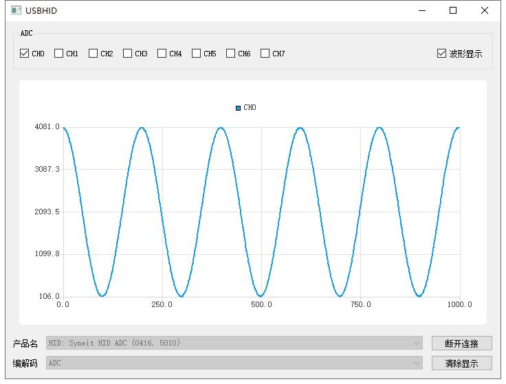
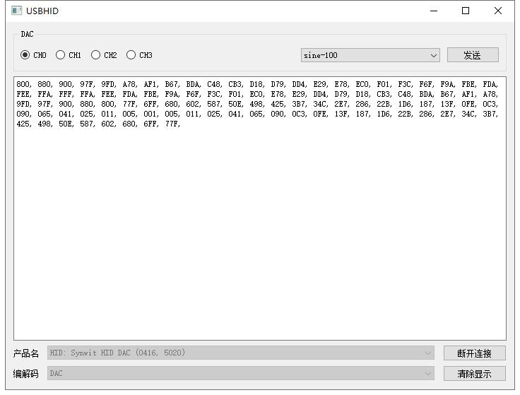
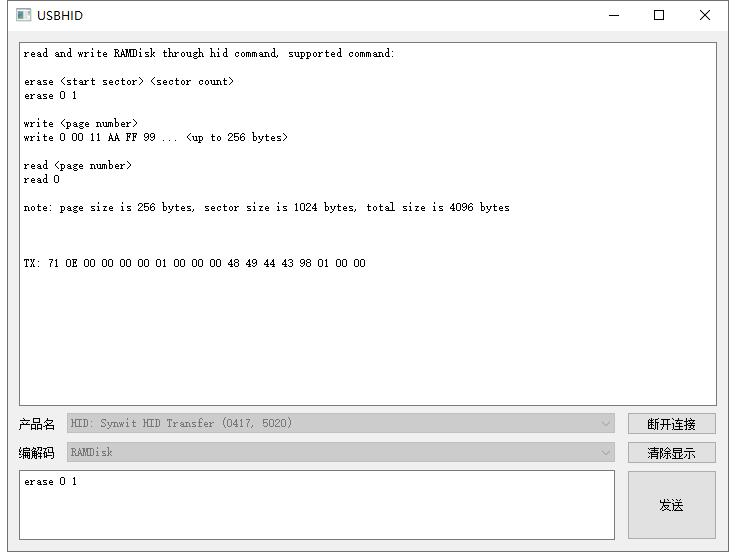

# USBHID
USB HID debug utility tool

To run this software, you need python 3.6+, pyqt5, pyqtchart and a usb backend (hidapi, pywinusb or pyusb)

`ADC` used for `SWM341_Lib/USBD/HID_ADC` testing.

`DAC` used for `SWM341_Lib/USBD/HID_DAC` testing.

`RAMDisk` used for `SWM341_Lib/USBD/HID_Transfer`, `SWM341_Lib/USBD/WINUSB_Transfer` and `SWM341_Lib/USBD/WINUSBv2_Transfer` testing.

